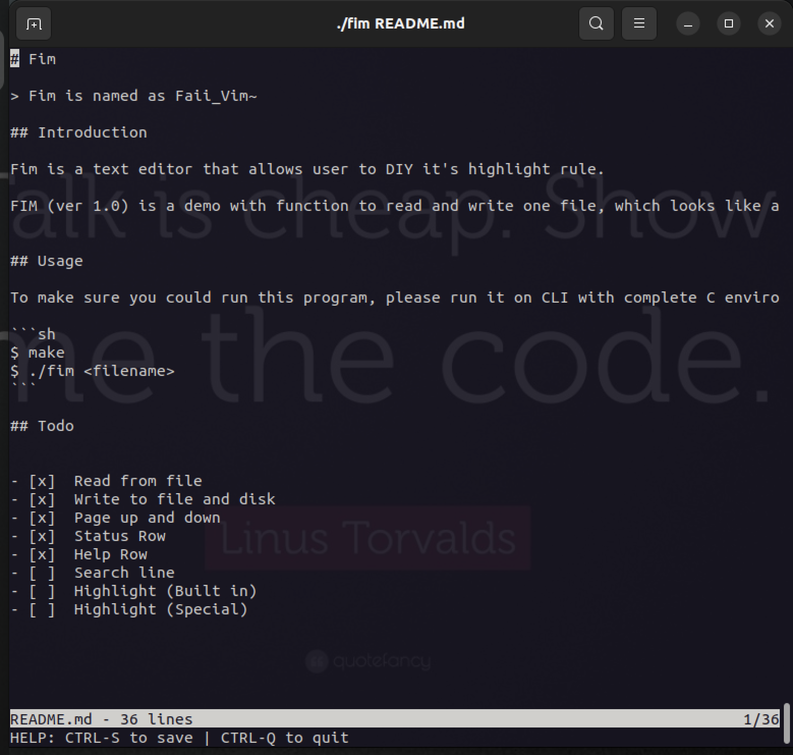

# Fim

> Fim is named as Faii_Vim~

## Introduction

Fim is a text editor that allows user to DIY it's highlight rule.

FIM (ver 1.0) is a demo with function to read and write one file, which looks like a simple text editor.




## Usage

To make sure you could run this program, please run it on CLI with complete C environment(gcc, make and so on).

```sh
$ make
$ ./fim <filename>
```

## Todo


- [x]  Read from file
- [x]  Write to file and disk
- [x]  Page up and down
- [x]  Status Row
- [x]  Help Row
- [ ]  Search line
- [ ]  Highlight (Built in)
- [ ]  Highlight (Special)


